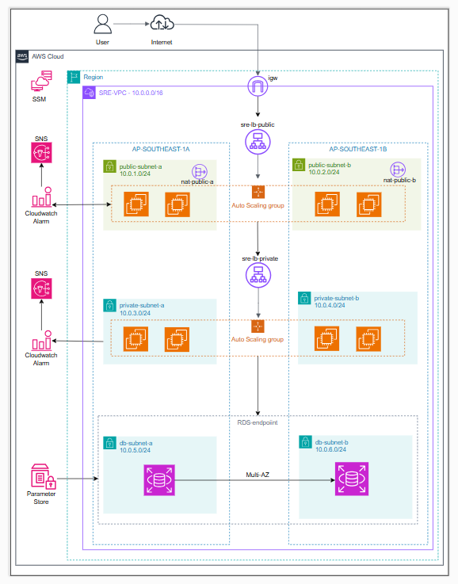

# AWS 3-Tier Architecture with Terraform

This project provisions a highly available and scalable 3-tier architecture on AWS using Terraform. It includes a web tier, application (backend) tier, and database tier, all designed with fault tolerance and automation in mind.

## 📐 Architecture Overview



- **Web Tier**:

  - 2 Public Subnets across 2 Availability Zones (AZs)
  - EC2 instances managed by an Auto Scaling Group
  - Exposed to the internet via an **Application Load Balancer (ALB)**

- **Application (Backend) Tier**:

  - 2 Private Subnets across 2 AZs
  - EC2 instances managed by an Auto Scaling Group
  - Accessed via an **Internal Load Balancer**

- **Database Tier**:
  - 2 DB Subnets across 2 AZs
  - **Multi-AZ RDS (PostgreSQL)** for high availability

## ⚙️ Features

- **Terraform**: Infrastructure is defined and provisioned using HashiCorp Terraform.
- **Auto Scaling**: Web and backend EC2 instances automatically scale **in/out** based on **CPU utilization**.
- **SNS Notification**: Email alerts are sent via **Amazon SNS** for scale-in and scale-out events.
- **Secure Credentials**: RDS database password is securely stored and retrieved from **AWS Systems Manager Parameter Store**.
- **IAM + SSM**: EC2 instances are accessible via **AWS Systems Manager Session Manager** — no need to open SSH (port 22).

## 🔐 Security

- No EC2 instances are directly exposed via SSH.
- Security Groups and Subnet configurations follow AWS best practices.
- Access to parameters and instances is tightly controlled via IAM.

## 🧰 Prerequisites

- Terraform v1.5 or later
- AWS CLI configured (`aws configure`)
- AWS IAM credentials with sufficient permissions

## 🚀 How to Deploy

```bash
git clone https://github.com/henryeff/HA.git
cd HA
terraform init
terraform plan
terraform apply
```
