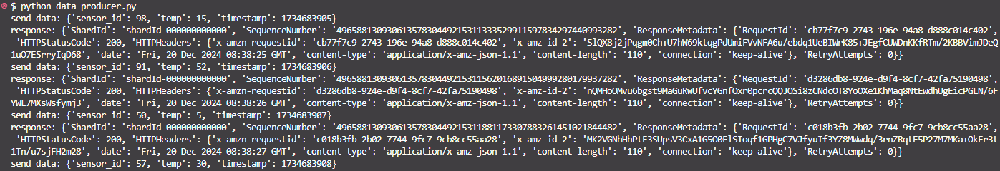
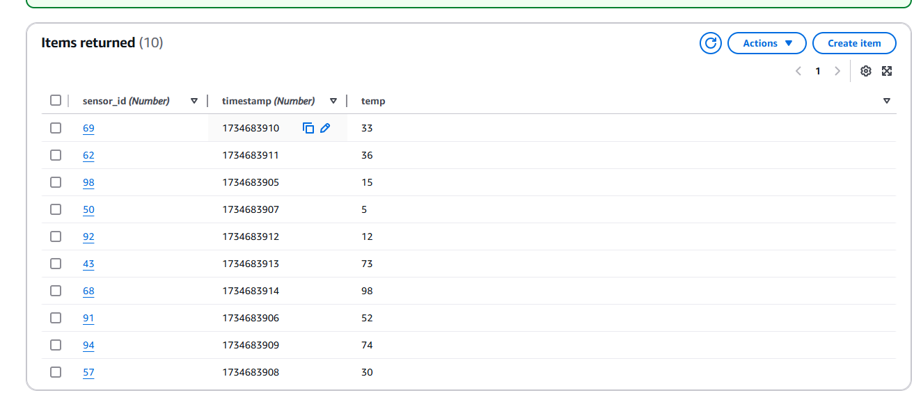

## **Run data_producer.py code in your local**

- change the stream_name and region in the data_producer.py code to your kinesis data stream name and the region that you deployed your data stream

```bash
kinesis_client = boto3.client('kinesis', region_name='ap-southeast-1')
stream_name='RealTimeDataStream'
```

- run the python code in your local

```bash
python data_producer.py
```



- Check the data are inserted to you dynamodb table  
  

---

## **NOTE: for troubleshooting you can check your lambda log in cloudwatch**
