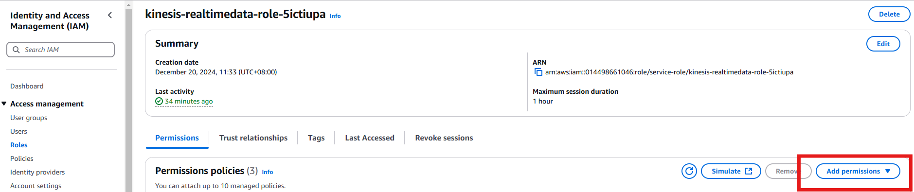

## **Create new IAM policies**

create new policy with this below json

```bash
{
    "Version": "2012-10-17",
    "Statement": [
        {
            "Sid": "VisualEditor0",
            "Effect": "Allow",
            "Action": [
                "kinesis:PutRecord",
                "kinesis:DescribeStreamSummary",
                "kinesis:ListShards",
                "kinesis:PutRecords",
                "kinesis:GetShardIterator",
                "kinesis:GetRecords",
                "kinesis:DescribeStream"
            ],
            "Resource": "*"
        },
        {
            "Sid": "VisualEditor1",
            "Effect": "Allow",
            "Action": [
                "kinesis:ListStreams",
                "dynamodb:PutItem",
                "dynamodb:DeleteItem",
                "dynamodb:GetItem",
                "dynamodb:Scan",
                "dynamodb:Query"
            ],
            "Resource": "*"
        }
    ]
}
```

---

## **Attached the newly created policy to lambda execution role**


