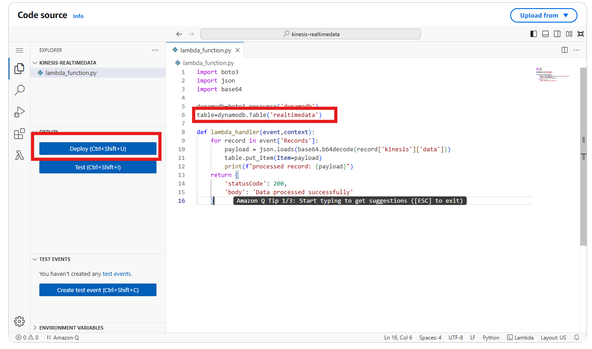
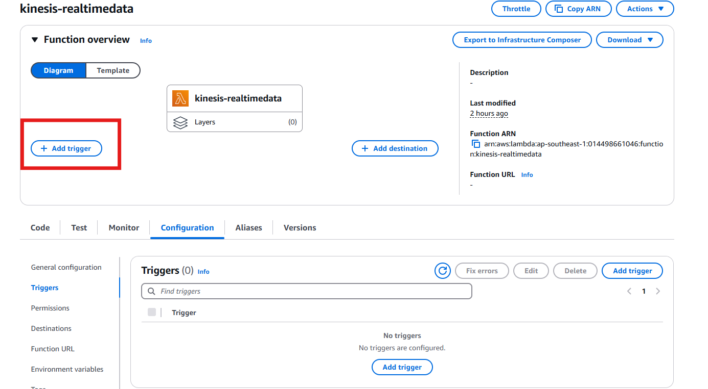
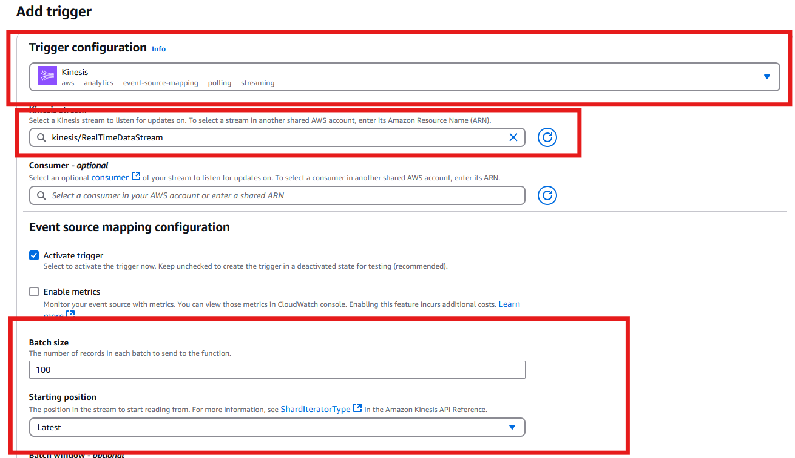

## **Create new lambda function**

---

## **Paste the lambda_function.py code into the code source**

- change table name in the code to your dynamo table name
- deploy the code
  

---

## **Add trigger**

Source: kinesis data stream  
Kinesis Stream: your data stream name create in kinesis  
Batch size: 100  
Starting position: Latest

- 
- 
