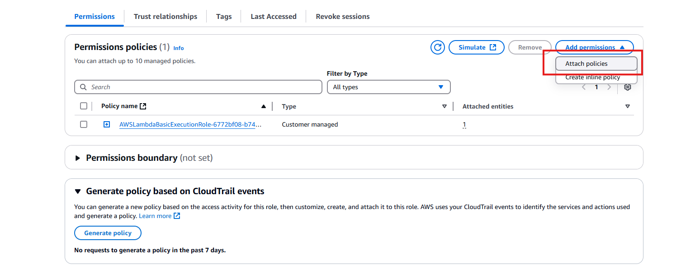

**Create new IAM policy**

- new IAM policy for lambda function to access dynamodb

```bash
{
    "Version": "2012-10-17",
    "Statement": [
        {
            "Sid": "VisualEditor0",
            "Effect": "Allow",
            "Action": [
                "dynamodb:PutItem",
                "dynamodb:GetItem",
                "dynamodb:Scan",
                "dynamodb:Query"
            ],
            "Resource": "*"
        }
    ]
}
```

- attach the new policy to lambda function role
  
