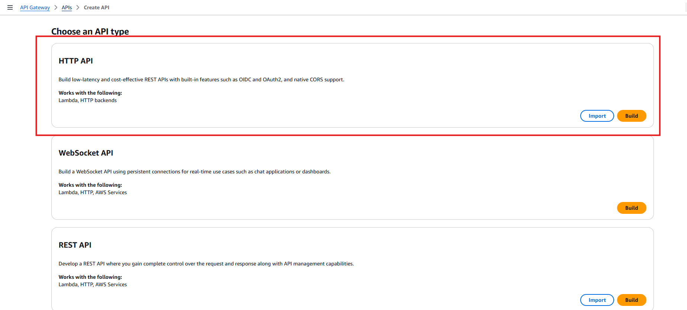
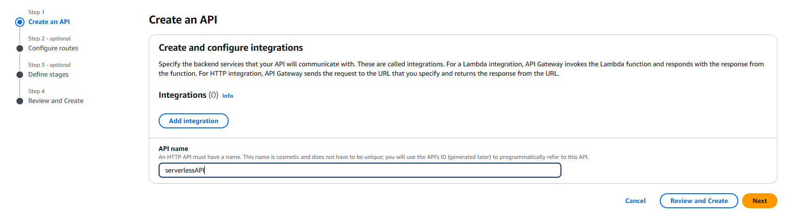
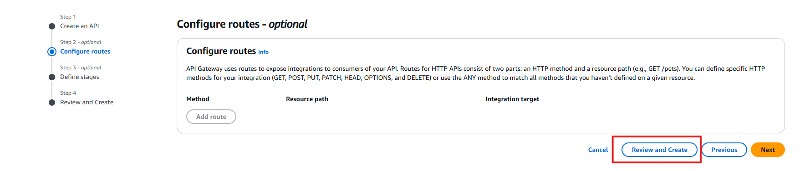
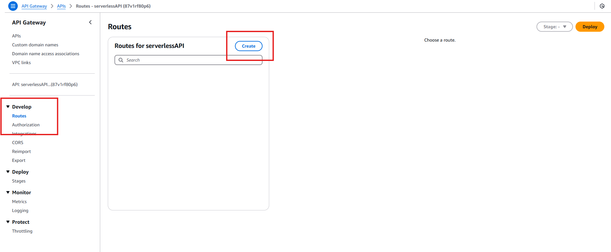
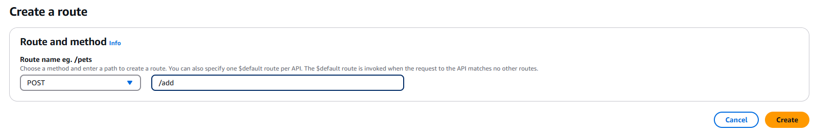
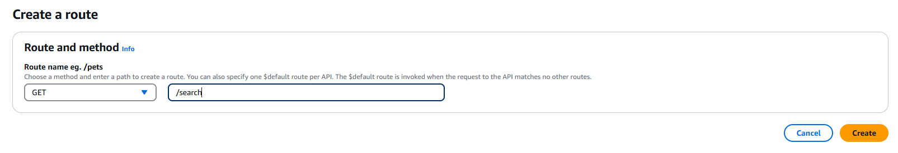
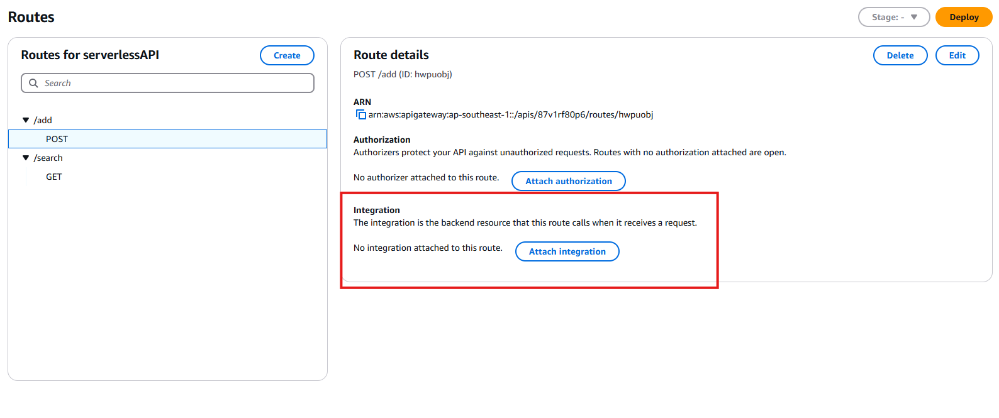
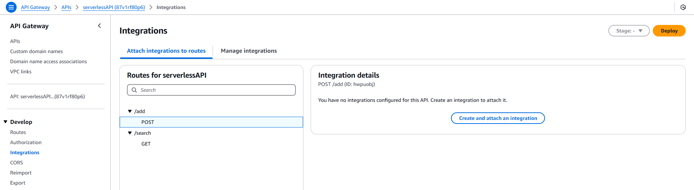
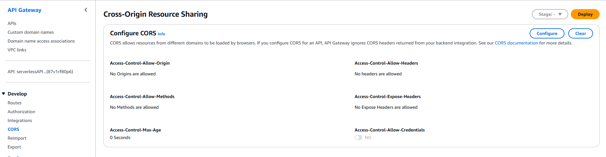

**Create new HTTP API gateway**

- create new HTTP API
  
  
  

- create routes for the API
  
  
  

- Integrate both api routes with lambda function
  
  
  

- Enable the CORS - Access-Control-Allow-Origin: **you can use \* to allow all or you can add your s3 bucket url to only allow your s3 bucket** - Access-Control-Allow-Headers: **content-type** - Access-Control-Allow-Methods: **GET, POST, DELETE**
  
  
