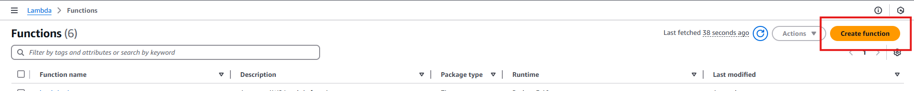
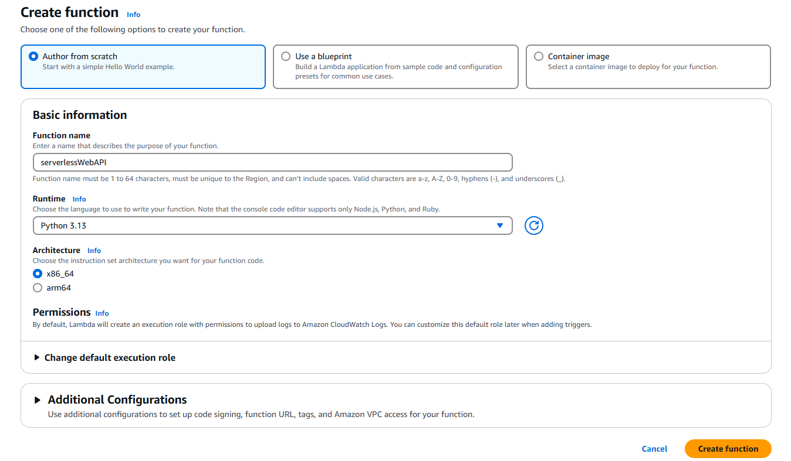
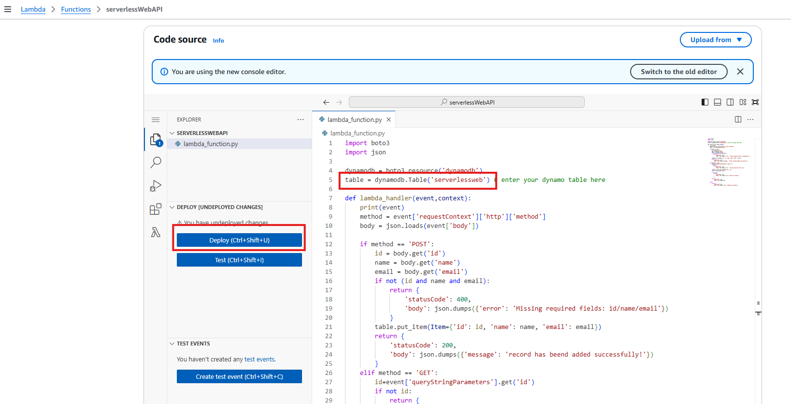

**Create new lambda function**

- create new lambda function using python as the runtime
- update table name inside the lambda_function.py to your dynamo table name
- deploy the function
  
  
  
