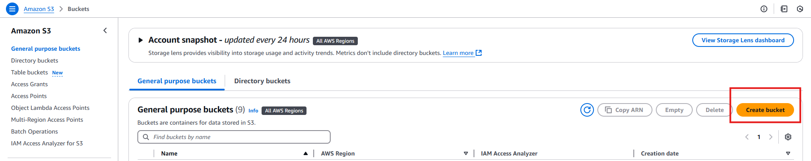
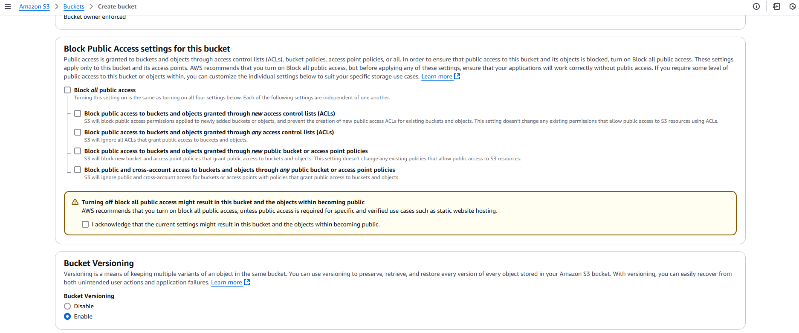
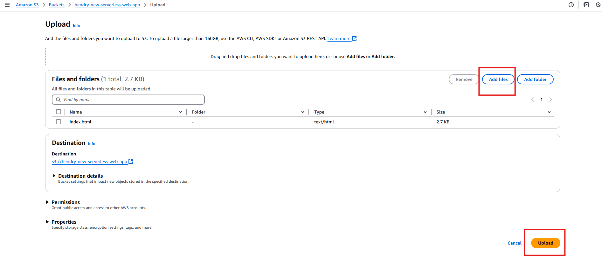
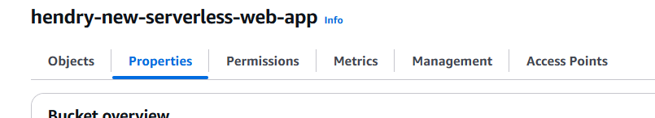
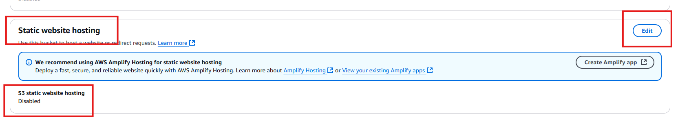
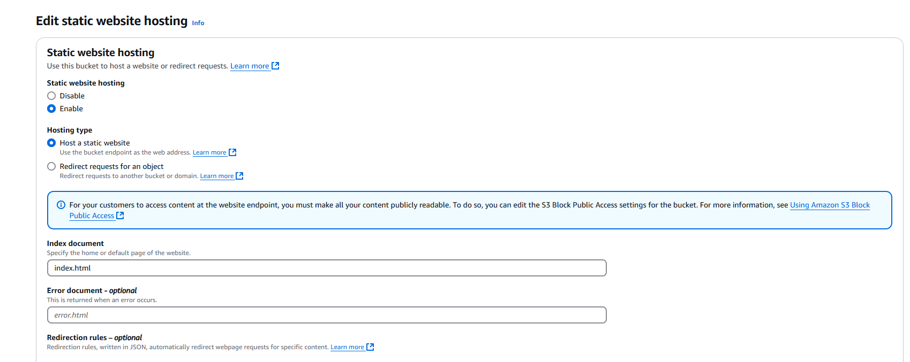

**Create New S3 Bucket**

- disable block all public access
- enable versioning
  
  

**upload index.html**

- NOTE: **Dont forget to update the api endpoint inside index.html to use your apigateway enpoint**
  

**Enable Static website hosting on your s3 bucket (under properties tab)**

- index document: **index.html**
  
  
  

**Add bucket policy (under permissions tab)**

- update: version,sid, resource to your own s3 bucket arn

```bash
{
    "Version": "2012-10-17",
    "Id": "Policy1734275284010",
    "Statement": [
        {
            "Sid": "Stmt1734275280275",
            "Effect": "Allow",
            "Principal": "*",
            "Action": "s3:GetObject",
            "Resource": "arn:aws:s3:::hendry-serverless-webapp/*"
        }
    ]
}
```
