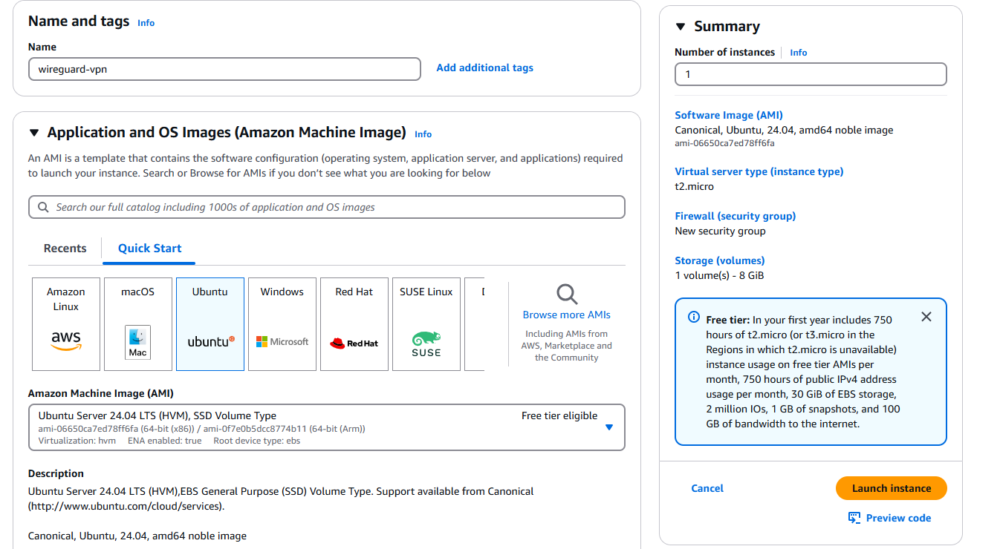
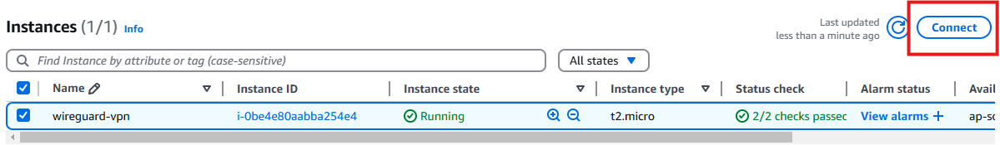
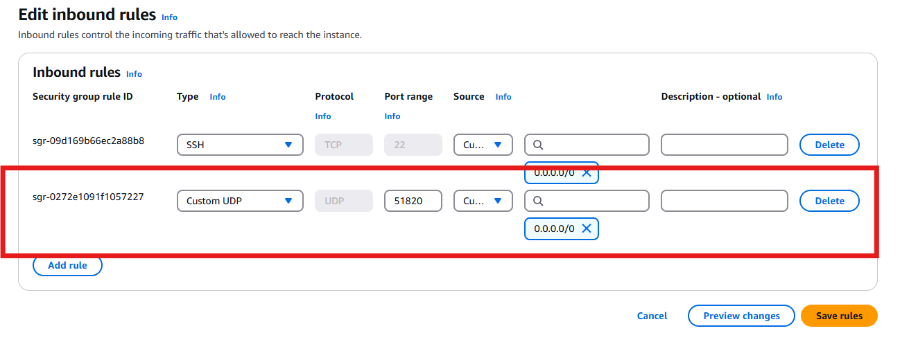

# 🖥️ **Create EC2 Instance**

1. **AMI**: Ubuntu Server 24.04 (or any other preferred free tier version)
2. **Key Pair**: Proceed without a key pair (the EC2 instance will be accessed via EC2 Instance Connect in the AWS Console)
3. **Security Group**: Create a new Security Group
4. **Storage**: 1x 8GB GP3 (or any other free tier storage option)

   

---

# 🛠️ **Install and Configure WireGuard on the Server**

### 1. **Connect to the EC2 Instance**

Access the EC2 instance using **EC2 Instance Connect** through the AWS Console.



### 2. **Update the Server & Install WireGuard**

Run the following command to update the server:

```bash
sudo apt update && sudo apt upgrade -y
sudo apt install wireguard -y
```

### 3. **Enable IP Forwarding**

Enable IP forwarding to allow the EC2 instance to route network traffic:

```bash
sudo sysctl -w net.ipv4.ip_forward=1
echo "net.ipv4.ip_forward=1" | sudo tee -a /etc/sysctl.conf
sudo sysctl -p
```

### 4. **Generate Server Keys**

Generate the private and public keys for both the server and the phone:

```bash
wg genkey | tee server_private_key | wg pubkey > server_public_key
wg genkey | tee phone_private_key | wg pubkey > phone_public_key
```

Four keys files will be created:

1. server_public_key
2. server_private_key
3. phone_public_key
4. phone_private_key

### 5. **Create WireGuard Server Configuration**

```bash
sudo vi /etc/wireguard/wg0.conf
```

add the following configuration to the wg0.conf file:

```bash
[Interface]
PrivateKey = **paste your server_private_key value here**
Address = 10.0.0.1/24
ListenPort = 51820
PostUp = iptables -t nat -A POSTROUTING -o enX0 -j MASQUERADE; iptables -A FORWARD -i %i -j ACCEPT; iptables -A FORWARD -o %i -j ACCEPT
PostDown = iptables -t nat -D POSTROUTING -o enX0 -j MASQUERADE; iptables -D FORWARD -i %i -j ACCEPT; iptables -D FORWARD -o %i -j ACCEPT

[Peer]
PublicKey = **paste your phone_public_key value here**
AllowedIPs = 10.0.0.2/32
```

### 6. **Create WireGuard Configuration for your Phone**

Next, create the config file for your phone:

```bash
vi phone.conf
```

add the following configuration to the phone.conf file:

```bash
[Interface]
PrivateKey = **paste your phone_private_key value here**
Address = 10.0.0.2/24
DNS = 8.8.8.8

[Peer]
PublicKey = **paste your server_public_key value here**
Endpoint = **paste your server IP address here**:51820
AllowedIPs = 0.0.0.0/0
PersistentKeepalive = 21
```

### 7. **Install QRCode generator on the server**

To transfer the config to your phone without scp, we need to install QR code generator:

```bash
sudo apt install qrencode -y
```

### 8. **Update Security Group**

Update your EC2 instance inbound security group to allow **udp port 51820 from anywhere**


