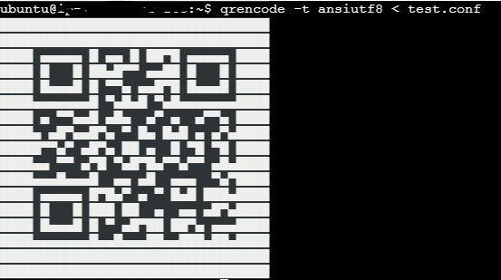
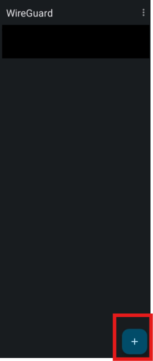
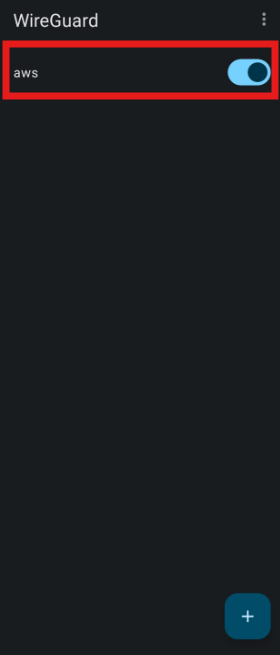
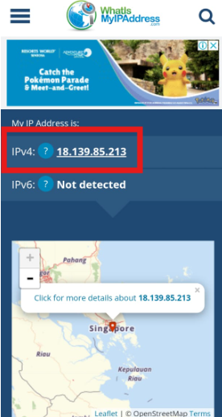

# 📝 **How to connect your phone to WireGuard in your EC2**

### 0. **PREREQUISITE: [EC2 Instance Setup](EC2.MD)**

Before proceeding, ensure that the EC2 instance is properly set up by following the instructions in the [EC2 Instance Setup](EC2.MD) document.

### 1. **Start the WireGuard Service**

Begin by starting the WireGuard service on your server with the following command:

```bash
sudo systemctl start wg-quick@wg0
```

### 2. **Download WireGuard App**

Install the WireGuard app on your mobile device from **Google Play** or the \*_App Store_.

### 3. **Generate the QR Code for your phone.conf**

On your server, generate a QR code for your phone.conf file using the following command:

```bash
qrencode -t ansiutf8 < phone.conf
```



### 4. **Add a new connection on your WireGuard App**

Open the WireGuard app on your phone and tap the ➕ button to add a new connection.


### 5. **Scan the QR Code**

Use your mobile device’s camera or the WireGuard app to scan the QR code generated on your server.

### 6. **Connect to your VPN**

Once the configuration is added, connect to your newly set up VPN. To verify the connection, visit [What Is My IP Address?](https://whatismyipaddress.com/) to check your phone's public IP address matched with your EC2's public ip address
  


